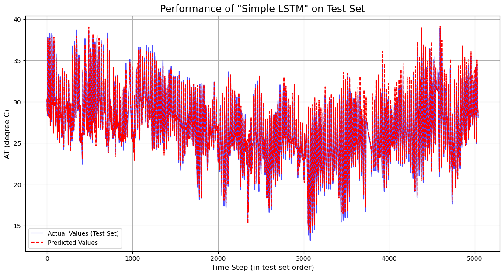
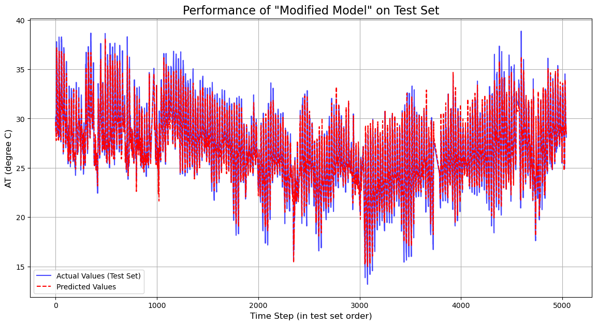
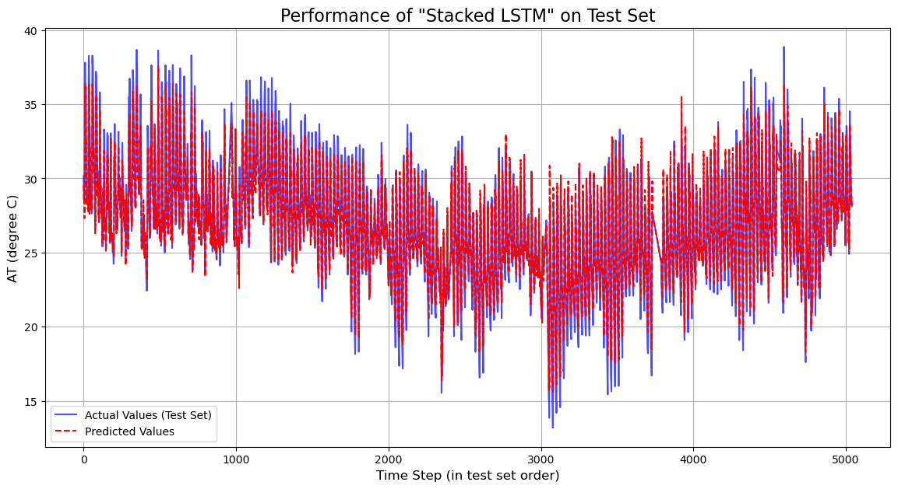
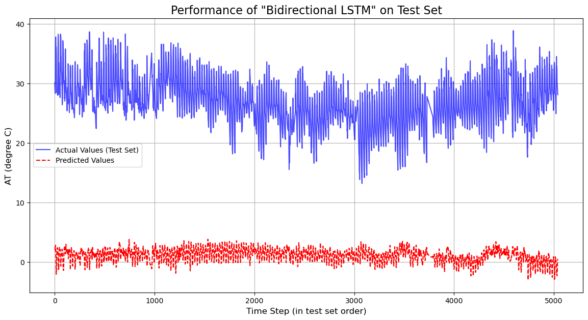

# Multivariate Time Series Forecasting for Air Quality Prediction using LSTMs

This repository contains a deep learning project focused on forecasting air quality (specifically, the 'AT' parameter) using multivariate time series data. The project explores and compares the performance of several Long Short-Term Memory (LSTM) based neural network architectures to build a robust predictive model.

## **Project Overview**

The primary objective of this project is to accurately predict future air quality levels based on historical data from various environmental sensors. Air quality forecasting is a critical task for public health and environmental management. By leveraging deep learning, specifically recurrent neural networks (RNNs) like LSTM, we can model the complex, non-linear relationships and temporal dependencies between different atmospheric variables.

This project was undertaken as part of a deep learning course, utilizing a specific partition of a dataset that included manual adjustments such as null values and duplications, simulating real-world data cleaning and preprocessing challenges.

## **Methodology**

The project workflow involves several key stages, from data preparation to model training, evaluation, and comparison.

### **1. Data Preprocessing**

Before feeding the data into the neural networks, a series of preprocessing steps were essential to ensure model stability and performance:
* **Data Cleaning**: The initial dataset was inspected for and handled missing or null values to prevent errors during training.
* **Feature Scaling**: All numerical features were scaled to a range between 0 and 1 using `MinMaxScaler`. This is a crucial step for neural networks, as it helps the gradient descent algorithm converge faster and avoids the domination of features with larger numeric ranges.
* **Data Sequencing**: Time series data was transformed into sequences of a fixed length (e.g., using the last 60 time steps to predict the next one). This windowing technique creates supervised learning samples (features and labels) that LSTMs can process.

### **2. Model Architectures**

Several LSTM-based models were implemented and trained to identify the most effective architecture for this forecasting task:

* **Simple LSTM**: A baseline model with a single LSTM layer, followed by a dense output layer. This model is effective at capturing basic temporal patterns.
* **Stacked LSTM**: A model with multiple LSTM layers stacked on top of each other. This allows the network to learn higher-level temporal representations, potentially capturing more complex dynamics in the data.
* **Bidirectional LSTM (Bi-LSTM)**: This architecture processes the data in both forward and backward directions. By learning from both past and future contexts, Bi-LSTMs can often achieve a more comprehensive understanding of the time series patterns.

### **3. Training and Evaluation**

All models were trained using the **Adam optimizer** and the **Mean Squared Error (MSE)** loss function. To provide a comprehensive comparison, the models were evaluated on a held-out test set using the following metrics:
* **Mean Squared Error (MSE)**: Measures the average squared difference between the estimated values and the actual value.
* **Root Mean Squared Error (RMSE)**: The square root of the MSE, providing an error metric in the same units as the target variable.
* **Mean Absolute Error (MAE)**: Measures the average magnitude of the errors in a set of predictions, without considering their direction.

## **Results and Analysis**

The performance of each model was rigorously compared based on the evaluation metrics and visual inspection of their predictions against the actual values.

### **Model Performance Metrics**
| Model | Mean Squared Error (MSE) | Root Mean Squared Error (RMSE) | Mean Absolute Error (MAE) |
| :--- | :--- | :--- | :--- |
| **Simple LSTM** | **0.000187** | **0.013661** | **0.009941** |
| **Stacked LSTM**| 0.000213 | 0.014605 | 0.010537 |
| **Bi-LSTM** | 0.000201 | 0.014163 | 0.010372 |

Based on the quantitative results, the **Simple LSTM model achieved the lowest error** across all metrics, indicating the most accurate predictions on the test set.

### **Visualizations**

The following plots illustrate the predictive performance of each model on the test data.

**Simple LSTM Model Performance**


**Modified LSTM Model Performance**


**Stacked LSTM Model Performance**


**Bidirectional LSTM Model Performance**



### **Conclusion**

For this specific air quality forecasting problem, the **Simple LSTM model provided the best balance of simplicity and predictive power**. The more complex architectures, such as the Stacked and Bidirectional LSTMs, did not yield superior results, suggesting that the underlying temporal patterns in the data were sufficiently captured by the single-layer LSTM. The Bidirectional model, in particular, struggled to generalize effectively, as seen in its visual performance.

## **How to Get Started**

To replicate the results, you can run the `forecasting.ipynb` notebook.

### **Prerequisites**

Ensure you have Python 3 and the following libraries installed:
* TensorFlow
* NumPy
* Pandas
* Matplotlib
* Scikit-learn

### **Installation & Execution**

1.  **Clone the repository:**
    ```sh
    git clone [https://github.com/your_username/Multivariate-Time-Series-Forecasting-for-Air-Quality-Prediction.git](https://github.com/your_username/Multivariate-Time-Series-Forecasting-for-Air-Quality-Prediction.git)
    ```
2.  **Navigate to the directory:**
    ```sh
    cd Multivariate-Time-Series-Forecasting-for-Air-Quality-Prediction
    ```
3.  **Install dependencies:**
    ```sh
    pip install tensorflow numpy pandas matplotlib scikit-learn
    ```
4.  **Launch Jupyter Notebook and run the `forecasting.ipynb` file:**
    ```sh
    jupyter notebook forecasting.ipynb
    ```
